# APPROOV SHAPES DEMO SERVER

This demo uses the Shapes server that has the endpoint `/shapes` protected by an Approov token and the endpoint `/hello` without the Approov token protection.

We will demonstrate how to call each API endpoint with screen-shots from Postman
and from the shell terminal.

The Postman view tell us how we performed the request and what response we got
back and the shell terminal view contains the log entries that lets us know the
result of checking the Approov token and how the requested was handled.

## REQUIREMENTS

* NodeJS
* Postman - to simulate calls to the the API server.

## INSTALL

### Approov Shapes Demo Server

The demo is not in NPM, thus we need to clone it...

```bash
git clone https://github.com/approov/nodejs-express_shapes-demo-server.git approov-demo && cd appoov-demo
```

### Development Environment

In order to have an agnostic development environment through this tutorial we recommend the use of Docker, that can be installed by following this official instructions. Additionally Docker Compose is also required and the installation instructions can be found here.

#### Building the docker image:

```bash
./stack build server
```
> The image will contain the Shapes Demo Server in NodeJS and Postman.

#### Getting a bash shell terminal inside the docker container:

```bash
./stack shell
```
> If you choose to continue following this demo using Docker, then all subsequent
  shell terminal commands must be executed from this shell terminal.

## SETUP

### Installing dependencies

```bash
npm install
```

### Starting Postman

Postman is necessary to simulate the mobile app requests when connecting to the
API server.

```bash
 postman > /dev/null &
```
> the `/dev/null` will ignore any output to the terminal and `&` is to allow Postman to run in the background.


## RUNNING THE APPROOV SHAPES DEMO SERVER

We will run this demo first with Approov enabled and a second time with Approov
disabled. When Approov is enabled any API endpoint protected by an Approov token
will have the request denied with a `400` response for each time the Approov
token check fails for any reason. When Approov is disabled the check still
takes place but no requests are denied, only the reason for the failure is
logged, if debug is enabled.

### The logs

In each line of the shell views, after `[nodemon] starting node src/index.js`,
we can see that it starts in the format `package-name:file-name`, thus is easy
to see from where the log entry is coming.

If we look closer to all this log entries we can see that each one contains in
the end of the line something in the format of `Debug Code: unique-sting-id`,
that matches the one present in each of  `400` responses we see in Postman.

Searching the logs with the value for the debug code makes easy to track down
the flow of the request until a response is sent back, without missing any log
entry for that request and totally suppressing guess work to pair log entries
with requests.


### Starting the NodeJS Express server

To start the server we want to issue the command:

```bash
APPROOV_ENABLED=true DEBUG=server,server:*,approov:* npm start
```

> `APPROOV_ENABLED=true` will deny requests with a 400 response when they don't
  pass the Approov token check.
> `DEBUG=server,server:*,approov:*` will enable logging to the Shapes demo server
  and to the Approov Token Checker package.
> This environment values may also be defined in the `.env` file on the server root.


### Endpoint Not Protected by Approov

This endpoint does not benefit from Approov protection and the goal here is to show that both Approov protected and unprotected endpoints can coexist in the same API server.

#### /hello

Postman View:


> As we can see we have not set any headers.

Shell view:

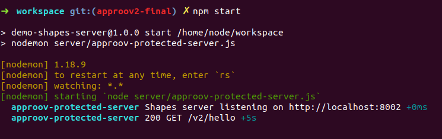
> As expected here the logs only have a reference to the router

### Endpoint Protected by Approov

This endpoint requires a `approov-token` header and depending on the boolean value for the environment variable `APPROOV_ENABLED` we will have 2 distinct behaviours. When being set to `true` we refuse to fulfill the request and when set to `false` we will let the request pass through. For both behaviours we always log the result of checking the Approov token and any exception that may occur during the process.

The default behaviour is to have `APPROOV_ENABLED` set to `true`, but you may feel more comfortable to have it setted to `false` during the initial deployment, until you are confident that you are only refusing bad requests to your API server.

#### /shapes - missing Approov token header

Let's see first this request with `APPROOV_ENABLED=true`.

Cancel current server session with `ctrl+c` and start it again with:

```bash
APPROOV_ENABLED=true DEBUG=server,server:*,approov:* npm start
```

Postman view:

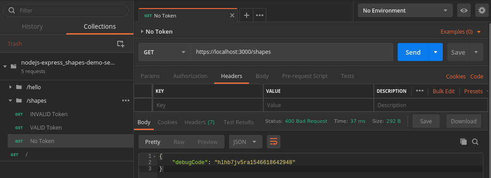


Shell view:

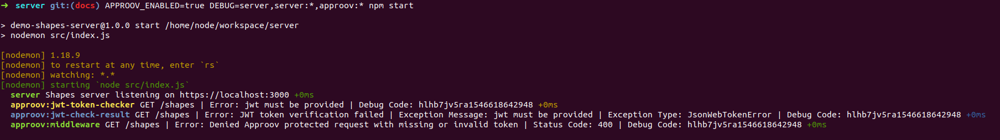
> Note:
>
> * see how the `debugCode` matches between the Postman view and the shell view.
> * use the `debugCode` to search your logs for all entries for a specific request.


Request Overview:

Looking to the Postman view we can see that we forgot to add the `approov-token`
header, thus a `400` response is returned without a reason but with a `debugCode`
to help us find it in the logs.

If we look closer into the shell view we see that `approov:jwt-token-checker`
and `approov:jwt-check-result` are telling us that a jwt is missing and that
the `approov:middleware` is informing us that denied the request with a `400`
response.

Did you notice that the debug code in the shell view log entries is exactly the
same returned in the Postman response?


**Let's see the same request with Approov disabled**

Cancel current server session with `ctrl+c` and start it again with:

```bash
APPROOV_ENABLED=false DEBUG=server,server:*,approov:* npm start
```

Postman view:

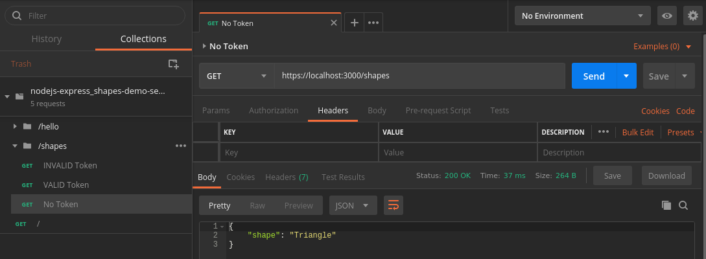


Shell view:

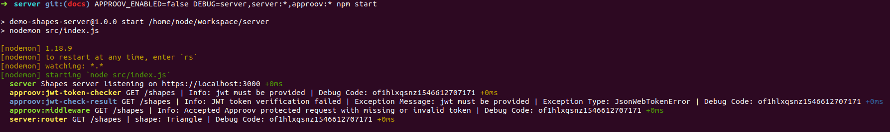
> Can you see where is the new log entry type?

Request Overview:

We continue to not provide the `approov-token` header but this time we have a
`200` response with the value for the shape, but once the Approov is disabled the
request is not denied.

Looking into the shell view we can see that `approov:jwt-token-checker` and
`approov:jwt-check-result` continue to tell us that the jwt must be provided,
but now we can see a new type of log entry, the `server:router`, that informs us
that the request was fulfilled and a response sent back with the value for the
shape.


#### /shapes - Invalid Approov token header

Let's see first this request with `APPROOV_ENABLED=true`.

Cancel current server session with `ctrl+c` and start it again with:

```bash
APPROOV_ENABLED=true DEBUG=server,server:*,approov:* npm start
```

Postman view:

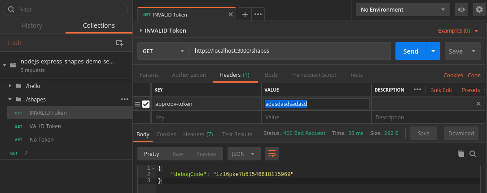


Shell view:

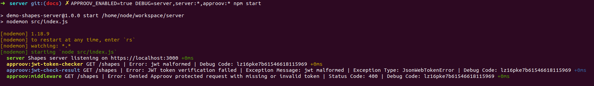


Request Overview:

In Postman we issue the request with an invalid `approov-token` header, that is
a normal string, not a jwt token, thus we get back a `400` response with the
debug code.

Looking to shell view we can see that `approov:middleware` is also telling us
that the request was denied with a `400` and from `approov:jwt-token-checker`
and `approov:jwt-check-result` we can see that the reason is that we have a
malformed jwt token.


**Let's see the same request with Approov disabled**

Cancel current server session with `ctrl+c` and start it again with:

```bash
APPROOV_ENABLED=false DEBUG=server,server:*,approov:* npm start
```

Postman view:

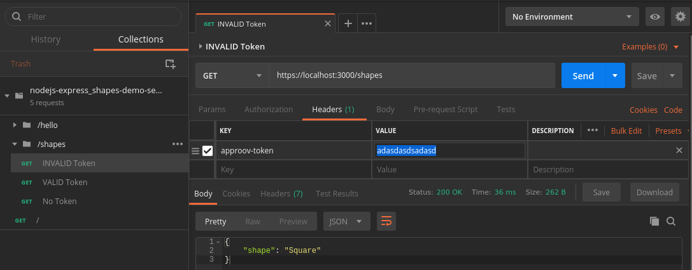


Shell view:

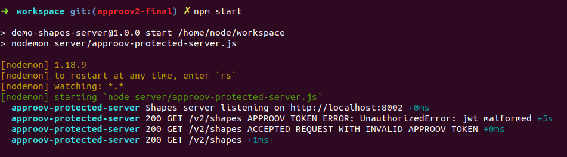


Request Overview:

In Postman, instead of sending a valid jwt token, we continue to send the
`approov-token` header as a normal string, but this time the request was not
rejected by the `approov:middleware`, and we have the `server:router` telling us
that a response was sent back.

The `approov:jwt-token-checker` and `approov:jwt-check-result` continue to tell
us that the same error occurred, a malformed jwt token, but this time using a
`Info` log level.

We can even see in Postman that the `shape` value matches the one logged into
the shell view.


#### /shapes - Valid Approov token header

Before we can test this endpoint in Postman we need to create a valid Approov
Token that will expire in 1 minute.

Cancel current server session with `ctrl+c`  and then type:

```bash
node test/helpers/generate-token.js --expires-in 1m
```
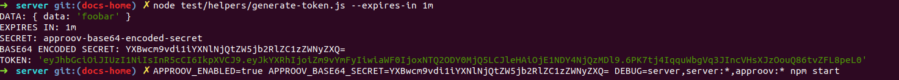

From the shell output we need to copy the `TOKEN:` string and add it to the 
`approov-header` in Postman. 

Let's see first this request with `APPROOV_ENABLED=true`:

```bash
APPROOV_ENABLED=true APPROOV_BASE64_SECRET=YXBwcm9vdi1iYXNlNjQtZW5jb2RlZC1zZWNyZXQ= DEBUG=server,server:*,approov:* npm start
```

Postman view with token valid for 1 minute:

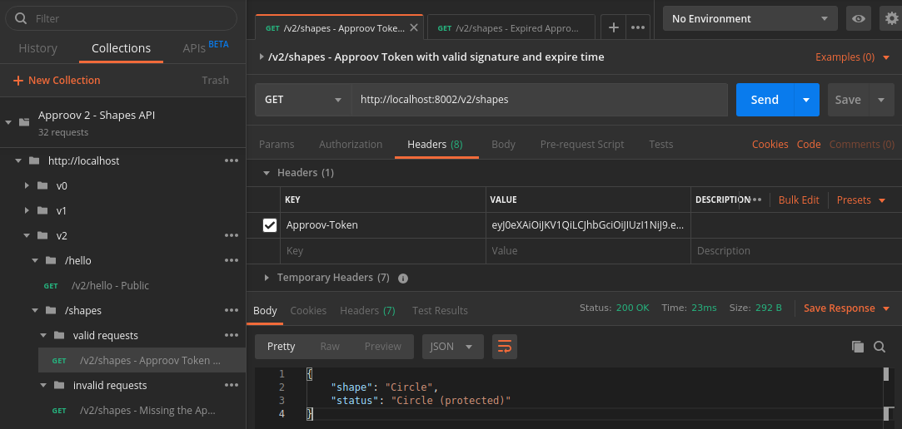

Postman view with same token but this time is expired:

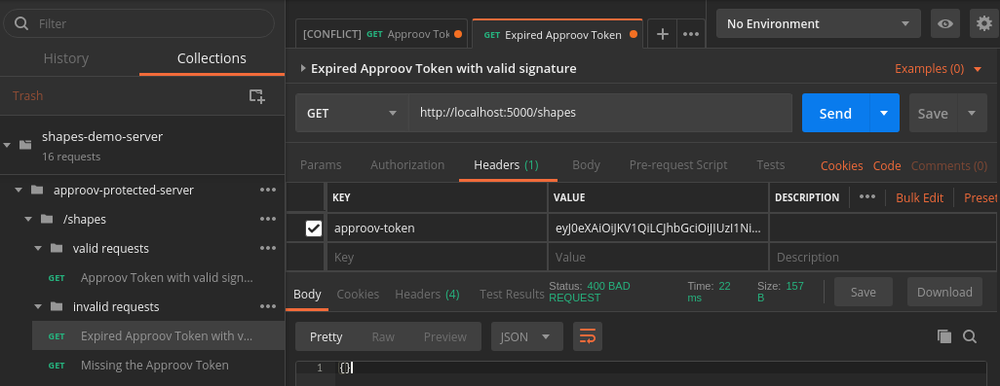


Shell view:

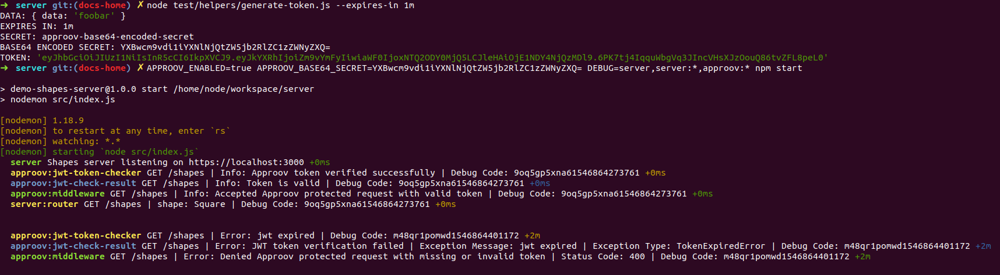


Request Overview:

We used an helper script to generate an Approov Token that was valid for 1 
minute.

In Postman we performed 2 requests with the same token and the first one was
successful, but the second request, performed 2 minutes later, failed with a 
`400` response because the token have already expired as we can see by the 
log messages in the shell view.


**Let's see the same request with Approov disabled**

Cancel current server session with `ctrl+c`  and then create another valid
Approov Token that will expire in 1 minute:

```bash
node test/helpers/generate-token.js --expires-in 1m
```
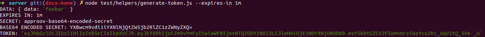

From the shell output we need to copy the `TOKEN:` string and add it to the 
`approov-header` in Postman. 

Cancel current server session with `ctrl+c` and start it again with:

```bash
APPROOV_ENABLED=false DEBUG=server,server:*,approov:* npm start
```
Postman view with token valid for 1 minute:

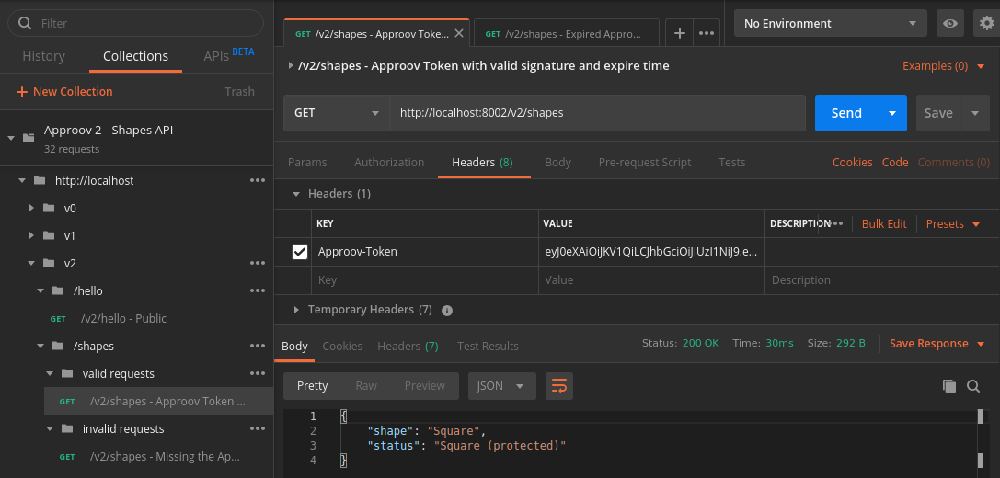

Postman view with same token but this time is expired:


Shell view:


Request Overview:

We repeated the process to generate the Appoov token with 1 minute of expiration
time.

Once more we performed the 2 requests with the same token and with 2 minutes 
interval between them but this time we got both of them with `200` responses.

If we look into the shell view we can see that the first request have
a valid token and in the second request the token is not valid because is 
expired.
