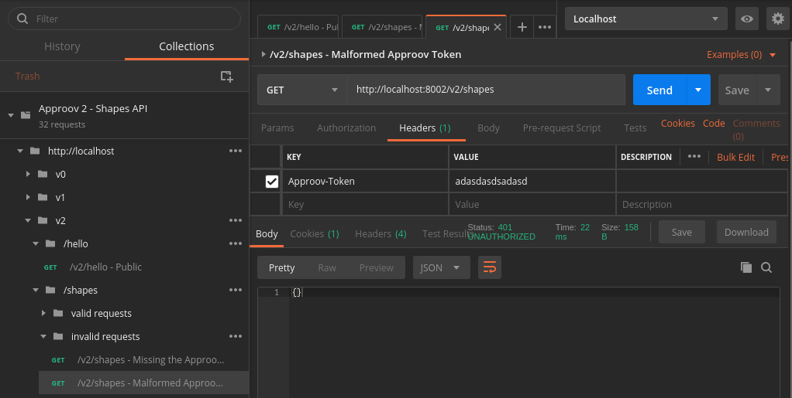
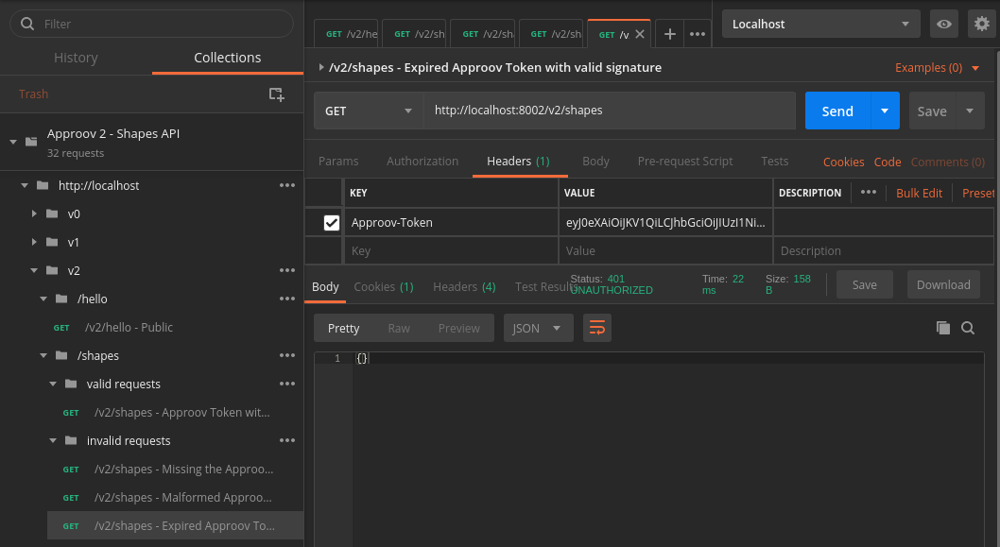
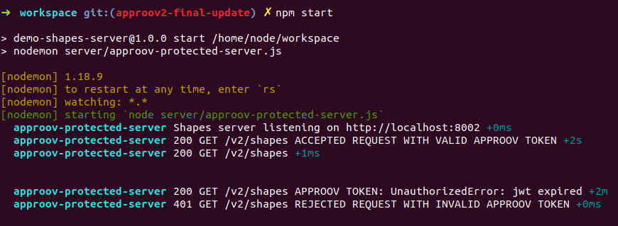
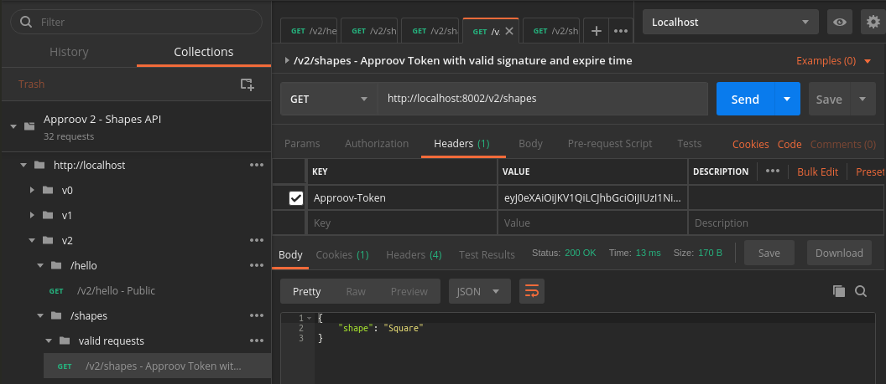
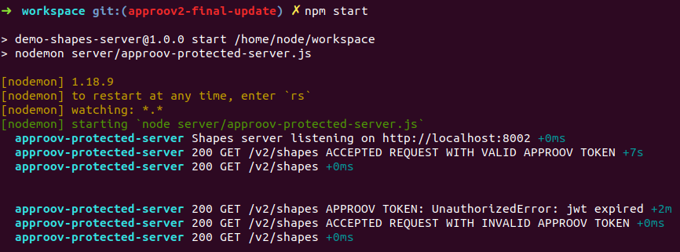
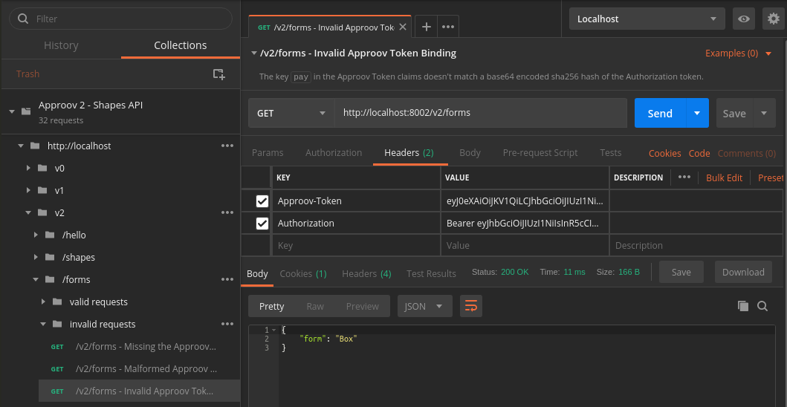
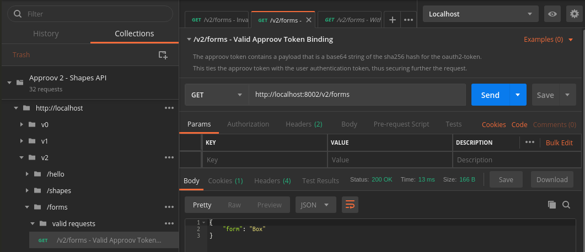

# APPROOV SHAPES API SERVER

The Approov Shapes Demo Server contains endpoints with and without the Approov
protection. The protected endpoints differ in the sense that they can use or not
the optional token binding feature for the Approov token.

We will demonstrate how to call each API endpoint with screen-shots from Postman
and from the shell. Postman is used here as an easy way to demonstrate
how you can play with the Approov integration in the API server, but to see a
real demo of how Approov would work in production you need to request a demo
[here](https://info.approov.io/demo).

When presenting the screen-shots we will show them as 2 distinct views. The
Postman view will tell how we performed the request and what response we got
back and the shell view show us the log entries that lets us see the result of
checking the Approov token and how the requested was handled.


## REQUIREMENTS

* Docker or NodeJS.
* Postman - to simulate calls to the the API server.

## SETUP

### Postman

To make the API request against the Shapes API server running on your machine you will need to use Postman and import [this collection](https://raw.githubusercontent.com/approov/postman-collections/master/quickstarts/shapes-api/shapes-api.postman_collection.json) that contains all the API endpoints prepared with all scenarios we want to demonstrate.

### Clone the Repo

To run the Shapes API server on localhost you will need to have the repos for this demo on your machine.

Clone from Github with:

```bash
git clone https://github.com/approov/quickstart-nodejs-express-token-check/.git
cd quickstart-nodejs-express-token-check/servers/shapes-api
```

### The Environment File

Lets' copy the `.env.example` to `.env` with the command:

```bash
cp .env.example .env
```

No modifications are necessary to the newly created `.env` in order to start running the demo.


### Docker Stack

In order to have an agnostic development environment through this tutorial we recommend the use of Docker, that can be installed by following [the official instructions](https://docs.docker.com/install/) for your platform, but feel free to use your own setup, provided it satisfies the [requirements](#requirements).

A symlink `./stack` to the bash script `./bin/stack.bash` is provided in the root of the demo, at `/servers/shapes-api`, to make easy to use the docker stack to run this demo.

Show the usage help by running from `/servers/shapes-api`:

```bash
./stack --help
```

#### Building the docker image

From your machine terminal run:

```bash
./stack build
```
> The image will contain the Shapes Demo Server in NodeJS.

#### Getting a bash shell inside the docker container

Unless you choose to not follow this demo with the provided docker stack you need to get a shell inside the docker container in order to run all the subsequent shell commands that you will be instructed to execute during the demo.

From your machine terminal execute:

```bash
./stack shell
```

#### Installing dependencies

From the docker container shell execute:

```bash
npm install
```

## RUNNING THE APPROOV SHAPES DEMO SERVER

We will run this demo first with Approov enabled and a second time with Approov
disabled. When Approov is enabled any API endpoint protected by an Approov token
will have the request denied with a `400` or `401` response. When Approov is
disabled the check still takes place but no requests are denied, only the reason
for the failure is logged.

### The logs

When a request is issued from Postman you can see the logs being printed to your
shell and you can search for `approov-protected-server` to see all log entries
about requests protected by Approov and compare the logged messages with the
results returned to Postman for failures or success in the validation of
requests protected by Approov.

An example for an accepted request:

```
approov-protected-server 200 GET /v2/forms ACCEPTED REQUEST WITH VALID APPROOV TOKEN +2m
approov-protected-server 200 GET /v2/forms ACCEPTED REQUEST WITH VALID APPROOV TOKEN BINDING +1ms
```

Examples for rejected requests:

```
approov-protected-server 200 GET /v2/forms ACCEPTED REQUEST WITH VALID APPROOV TOKEN +37s
approov-protected-server 200 GET /v2/forms APPROOV TOKEN BINDING ERROR: token binding in header doesn't match with the key 'pay' in the decoded token. +1ms
approov-protected-server 401 GET /v2/forms REJECTED REQUEST WITH INVALID APPROOV TOKEN BINDING +0ms
```

### Starting the NodeJS Express server

Before we start the server we will want to setup the debug level to be used across all restarts.

From the docker container shell run:

```bash
export DEBUG=approov-protected-server
```

To start the server we want to issue the command:

```bash
npm start
```

### Endpoint Not Protected by Approov

This endpoint does not benefit from Approov protection and the goal here is to
show that both Approov protected and unprotected endpoints can coexist in the
same API server.

#### /v2/hello

**Postman View:**


> As we can see we have not set any headers.

**Shell view:**


> As expected the logs don't have entries with Approov errors.


**Request Overview:**

Looking into the Postman view, we can see that the request was sent without the
`Approov-Token` header and we got a `200` response that matches the one in the
logs output from the shell view.


### Endpoints Protected by an Approov Token

The endpoints here will require an `Approov-Token` header and depending on the boolean
value for the environment variable `APPROOV_ABORT_REQUEST_ON_INVALID_TOKEN` we will
have 2 distinct behaviors. When being set to `true` we refuse to fulfill the
request and when set to `false` we will let the request pass through. For both
behaviors we log the result of checking the Approov token, but only if the environment
variable `APPROOV_LOGGING_ENABLED` is set to `true`.

The default behavior is to have `APPROOV_ABORT_REQUEST_ON_INVALID_TOKEN` set to
`true`, but you may feel more comfortable to have it set to `false` during
the initial deployment, until you are confident that you are only refusing bad
requests to your API server.

#### /v2/shapes - missing the Approov token header

Make sure that the `.env` file contains `APPROOV_ABORT_REQUEST_ON_INVALID_TOKEN` set to `true`.

Cancel current server session with `ctrl+c` and start it again with:

```bash
npm start
```

**Postman view:**


> As we can see we have not set any headers.

**Shell view:**


> As expected status code in the logs matches the one in the Postman response.

**Request Overview:**

Looking to the Postman view we can see that we forgot to add the `Approov-Token`
header, thus a `400` response is returned.

In the shell view we can see in the logs entries that Approov is enabled and the Approov token is empty and this is the reason why the `400` response was
returned to Postman.

**Let's see the same request with Approov disabled**

Make sure that the `.env` file contains `APPROOV_ABORT_REQUEST_ON_INVALID_TOKEN` set to `false`.

Cancel current server session with `ctrl+c` and start it again with:

```bash
npm start
```

**Postman view:**


> Did you notice that now we have a successfully response back?

**Shell view:**


> Can you see where are the new log entries?

**Request Overview:**

We continue to not provide the `Approov-Token` header but this time we have a
`200` response with the value for the shape, but once Approov is disabled the
request is not denied.

Looking into the shell view we can see that the logs continue to tell us that
the JWT token is empty, but now we can see a log entry for the `/v2/shapes`
endpoint response with the status code `200`, meaning that the request was
fulfilled and a successful response sent back.


#### /v2/shapes - Malformed Approov token header

Make sure that the `.env` file contains `APPROOV_ABORT_REQUEST_ON_INVALID_TOKEN` set to `true`.

Cancel current server session with `ctrl+c` and start it again with:

```bash
npm start
```

**Postman view:**


> Did you notice the `Approov-Token` with an invalid JWT token?

**Shell view:**


> Can you spot what is the reason for the `401` response?

**Request Overview:**

In Postman we issue the request with a malformed `Approov-Token` header, that is
a normal string, not a JWT token, thus we get back a `401` response.

Looking to shell view we can see that the logs is also telling us that the
request was denied with a `401` and that the reason is an invalid JWT token,
that doesn't contain enough segments.


**Let's see the same request with Approov disabled**

Make sure that the `.env` file contains `APPROOV_ABORT_REQUEST_ON_INVALID_TOKEN` set to `false`.

Cancel current server session with `ctrl+c` and start it again with:

```bash
npm start
```

**Postman view:**


**Shell view:**


**Request Overview:**

In Postman, instead of sending a valid JWT token, we continue to send the
`Approov-Token` header as a normal string, but this time we got a `200` response
back because Approov is disabled, thus not blocking the request.

In the shell view we continue to see the same reason for the Approov token
validation failure and we can confirm the `200` response as Postman shows.


#### /v2/shapes - Valid Approov token header

Make sure that the `.env` file contains `APPROOV_ABORT_REQUEST_ON_INVALID_TOKEN` set to `true`.

Cancel current server session with `ctrl+c` and start it again with:

```bash
npm start
```

> **NOTE**:
>
> For your convenience the Postman collection includes a token that only expires
> in a very distant future for this call "Approov Token with valid signature and
> expire time". For the call "Expired Approov Token with valid signature" an
> expired token is also included.


**Postman view with token correctly signed and not expired token:**


**Postman view with token correctly signed but this time is expired:**




**Shell view:**




**Request Overview:**

We used an helper script to generate an Approov Token that was valid for 1
minute.

In Postman we performed 2 requests with the same token and the first one was
successful, but the second request, performed 2 minutes later, failed with a
`400` response because the token have already expired as we can see by the
log messages in the shell view.


**Let's see the same request with Approov disabled**

Make sure that the `.env` file contains `APPROOV_ABORT_REQUEST_ON_INVALID_TOKEN` set to `false`.

Cancel current server session with `ctrl+c` and start it again with:

```bash
npm start
```
**Postman view with token valid for 1 minute:**



**Postman view with same token but this time is expired:**


**Shell view:**


> Can you spot where is the difference between this shell view and the previous
> one?

**Request Overview:**

We repeated the process to generate the Appoov token with 1 minute of expiration
time.

Once more we performed the 2 requests with the same token and with 2 minutes
interval between them but this time we got both of them with `200` responses.

If we look into the shell view we can see that the first request have
a valid token and in the second request the token is not valid because is
expired, but once Approov is disabled the request is accepted.

### Endpoints Protected with the Approov Token Binding

The token binding is optional in any Approov token and you can read more about them [here](./../README.md#approov-validation-process).

The requests where the Approov token binding is checked will be rejected on failure, but
only if the environment variable `APPROOV_ABORT_REQUEST_ON_INVALID_TOKEN_BINDING`
is set to `true`. To bear in mind that before this check is done the request
have already been through the same flow we have described for the `/v2/shapes` endpoint.


#### /v2/forms - Invalid Approov Token Binding

Make sure that the `.env` file contains `APPROOV_ABORT_REQUEST_ON_INVALID_TOKEN_BINDING` set to `true`.

Cancel current server session with `ctrl+c` and start it again with:

```bash
npm start
```

**Postman view:**


**Shell view:**


**Request Overview:**

In Postman we added an Approov token with a token binding not matching the
`Authorization` token, thus the API server rejects the request with a `401` response.

While we can see in the shell view that the request is accepted for the Approov
token itself, afterwards we see the request being rejected, and this is due to
an invalid token binding in the Approov token, thus returning a `401` response.

> **IMPORTANT**:
>
> When decoding the Approov token we only check if the signature and expiration
> time are valid, nothing else within the token is checked.
>
> The token binding check works on the decoded Approov token to validate if the
> value from the key `pay` matches the one for the token binding header, that in
> our case is the `Authorization` header.


**Let's see the same request with Approov disabled**

Make sure that the `.env` file contains `APPROOV_ABORT_REQUEST_ON_INVALID_TOKEN_BINDING` set to `false`.

Cancel current server session with `ctrl+c` and start it again with:

```bash
npm start
```

**Postman view:**



**Shell view:**


**Request Overview:**

We still have the invalid token binding in the Approov token, but once we have
disabled Approov we now have a `200` response.

In the shell view we can confirm that the log entry still reflects that the
token binding is invalid, but this time a `200` response is logged instead of
the previously `401` one, and this is because Approov is now disabled.


#### /v2/forms - Valid Approov Token Binding

Make sure that the `.env` file contains `APPROOV_ABORT_REQUEST_ON_INVALID_TOKEN_BINDING` set to `true`.

Cancel current server session with `ctrl+c` and start it again with:

```bash
npm start
```

**Postman view:**



**Shell view:**


**Request Overview:**

In the Postman view the `Approov-Token` contains a valid token binding, the
`Authorization` token value, thus when we perform the request, the API server
doesn't reject it, and a `200` response is sent back.

The shell view confirms us that the token binding is valid and we can also see
the log entry confirming the `200` response.
